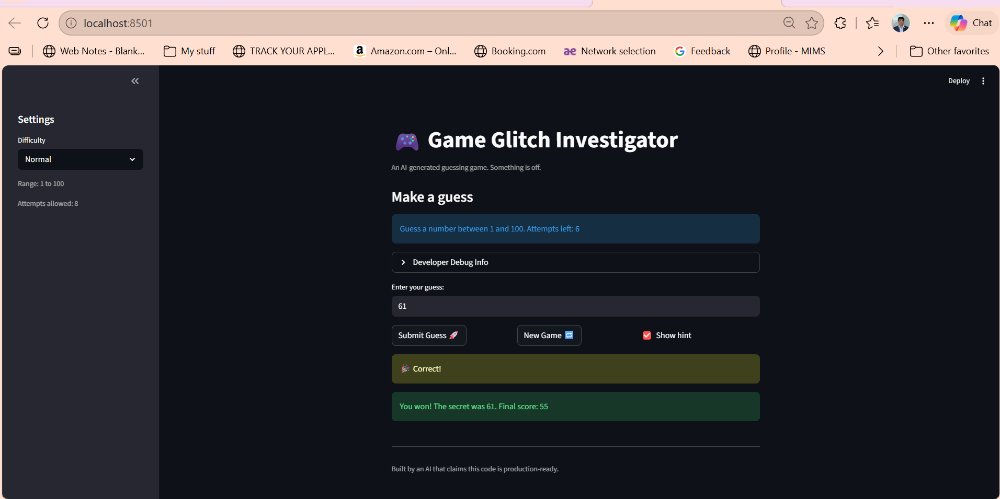

# 🎮 Game Glitch Investigator: The Impossible Guesser

## 🚨 The Situation

You asked an AI to build a simple "Number Guessing Game" using Streamlit.
It wrote the code, ran away, and now the game is unplayable. 

- You can't win.
- The hints lie to you.
- The secret number seems to have commitment issues.

## 🛠️ Setup

1. Install dependencies: `pip install -r requirements.txt`
2. Run the broken app: `python -m streamlit run app.py`

## 🕵️‍♂️ Your Mission

1. **Play the game.** Open the "Developer Debug Info" tab in the app to see the secret number. Try to win.
2. **Find the State Bug.** Why does the secret number change every time you click "Submit"? Ask ChatGPT: *"How do I keep a variable from resetting in Streamlit when I click a button?"*
3. **Fix the Logic.** The hints ("Higher/Lower") are wrong. Fix them.
4. **Refactor & Test.** - Move the logic into `logic_utils.py`.
   - Run `pytest` in your terminal.
   - Keep fixing until all tests pass!

## 📝 Document Your Experience

**The game's purpose:** An AI-generated Streamlit number guessing game where the player tries to guess a secret number within a certain number of attempts, based on Easy, Normal, or Hard difficulty settings.

**Bugs I found:**
1. **The "Lying Hint" Bug:** On even-numbered attempts, the game converted the secret and guess to strings, causing it to give mathematically incorrect "Higher/Lower" hints.
2. **The "Game Over" Loop:** The "New Game" button reset the secret number and attempts, but failed to reset the game's state back to "playing", leaving the player permanently stuck on the game over screen.
3. **The Hardcoded Difficulty Bug:** Clicking "New Game" always set the secret number between 1 and 100, completely ignoring the player's selected difficulty range.
4. **The "Failing Upward" Bug:** Incorrect guesses on even-numbered attempts actually added 5 points to the player's score instead of penalizing them.

**Fixes I applied:**
* Used GitHub Copilot to completely rewrite the `if new_game:` block so it correctly resets `st.session_state.status` to "playing" and pulls the correct `low` and `high` variables for the new secret number.
* Used Copilot's Agent Mode to refactor the `check_guess` and `parse_guess` functions out of `app.py` and into a dedicated `logic_utils.py` file.
* Stripped out the flawed string-conversion logic from the hint system so it strictly compares standard integers, fixing the lying hints.
* Wrote a custom `pytest` case in `test_game_logic.py` to verify the hint logic works correctly for high/low integer comparisons.

## 📸 Demo

 

